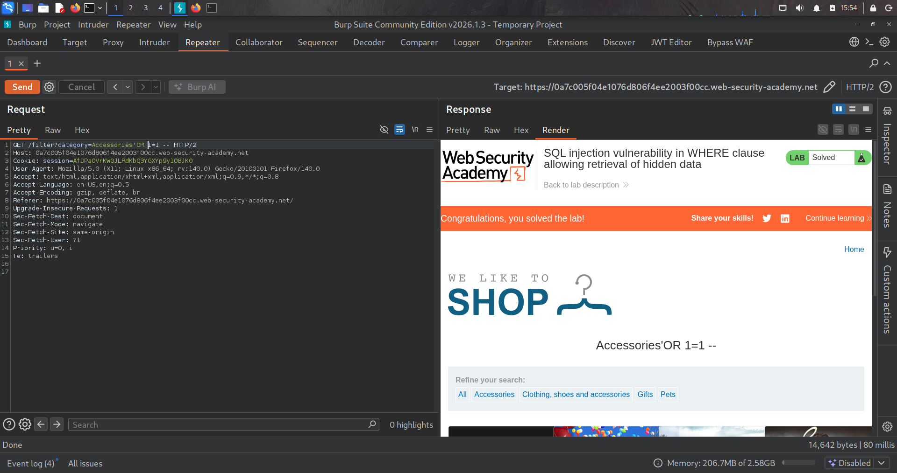

# Lab: SQL injection vulnerability in WHERE clause allowing retrieval of hidden data

https://portswigger.net/web-security/sql-injection/lab-retrieve-hidden-data

- الفكره من الLab ده انك تحاول تظهر المنتجات الي معملها اخفاء او مش ظاهره
- فا اول حاجه هنشوف كل function الي نقدر عليها ممكن تطلع في مكان نعرف نtest بيه
- مفيش ممكن نشوف request ممكن نلاقي حاجه نعملها inject

```bash
1. GET /filter?category=Accessories HTTP/2 ==> parameter المصاب

2. code inject هو هو code exploitation 

3. SELECT * FROM products WHERE category = 'Gifts' AND released = 1 ==> دي SQL query المصابه 

4. 'OR 1=1 -- 
```


