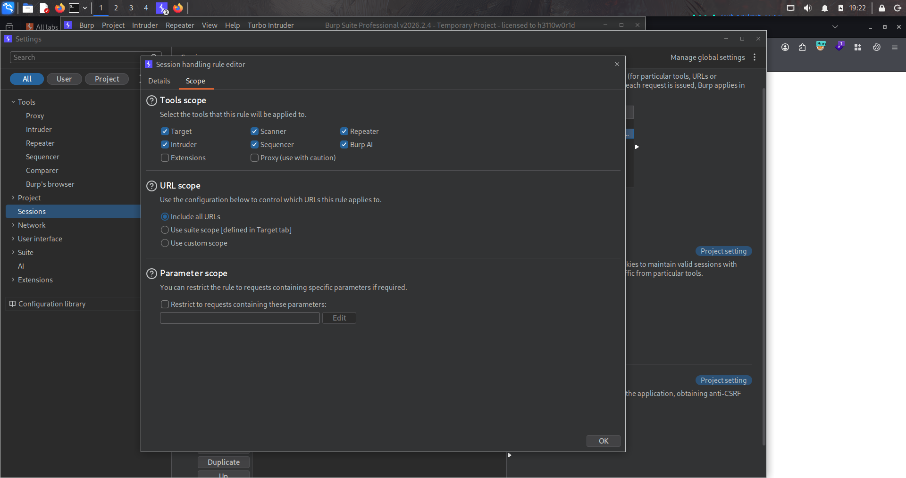
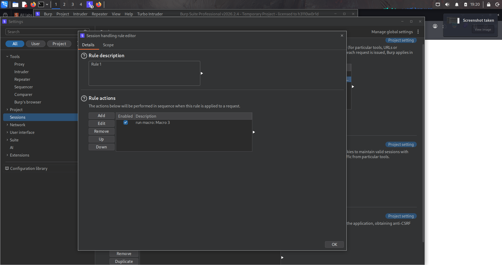
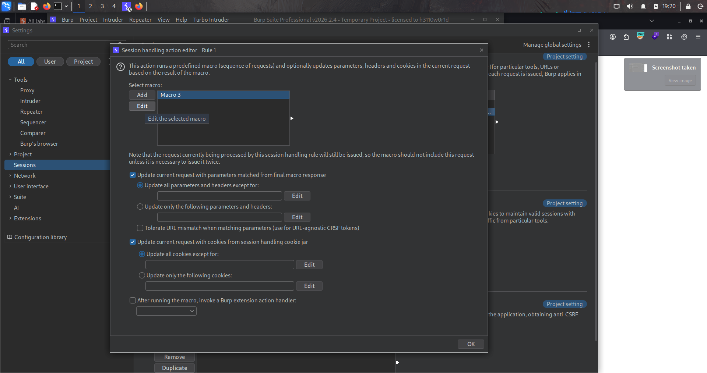
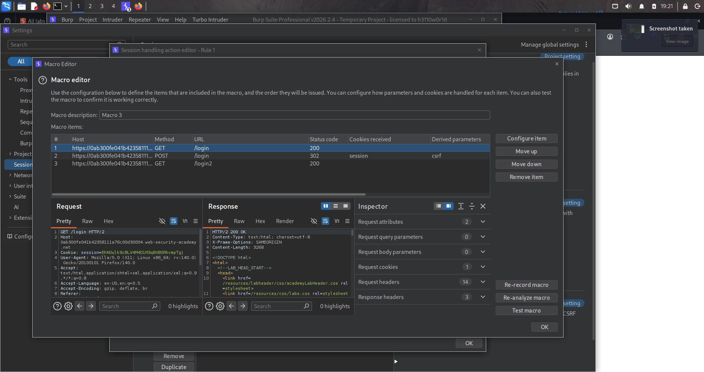
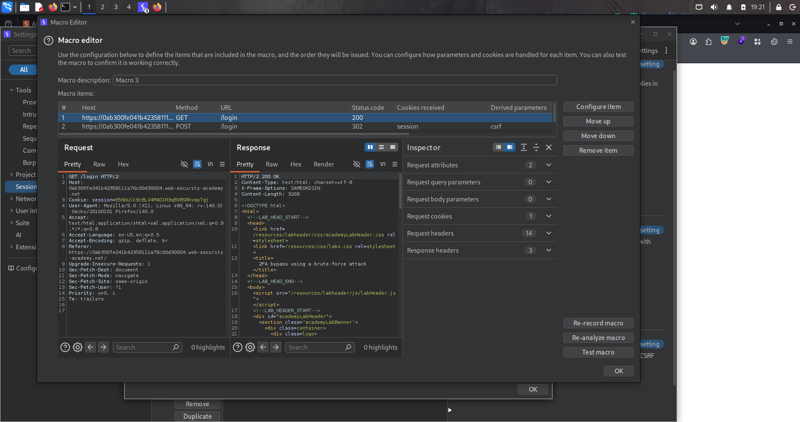
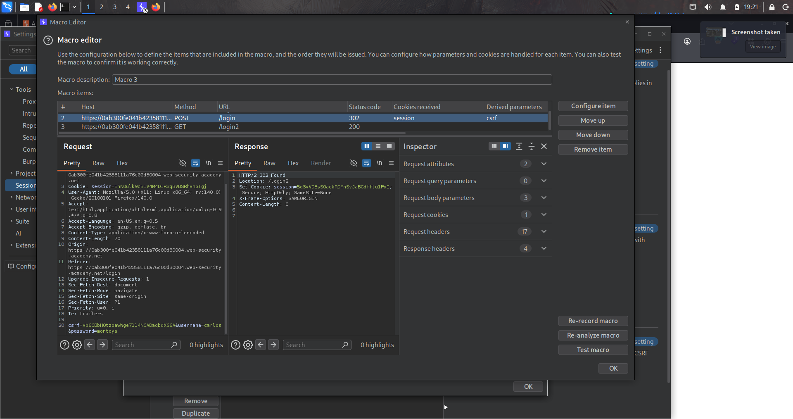
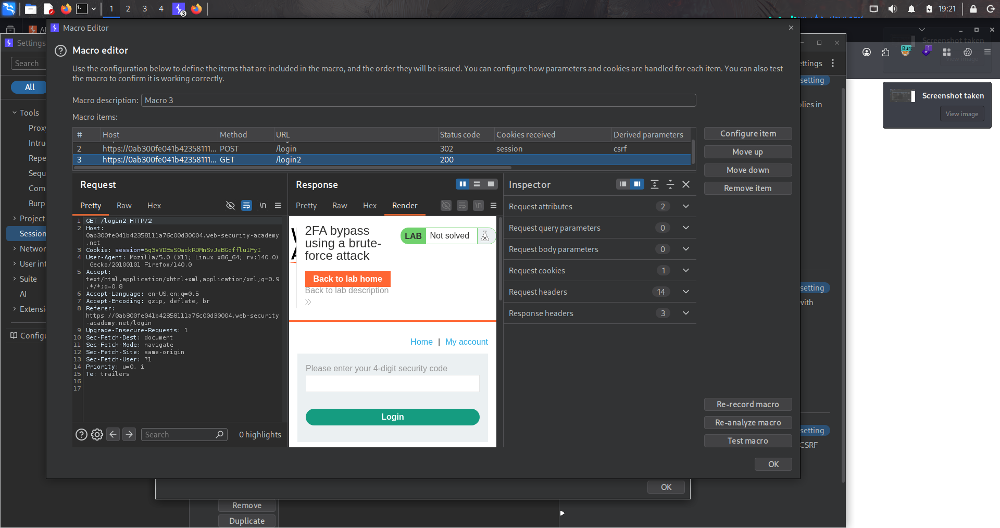
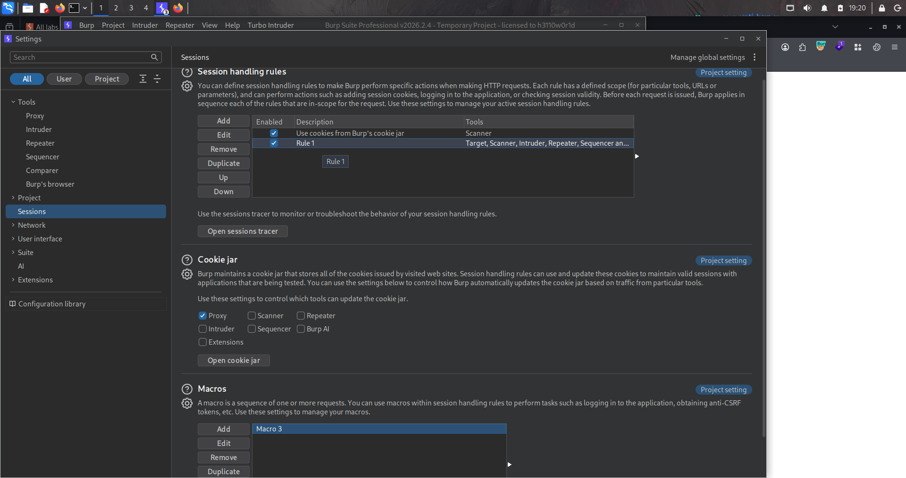
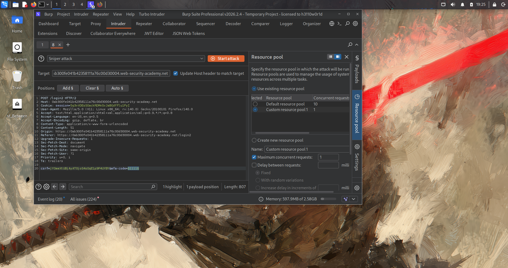
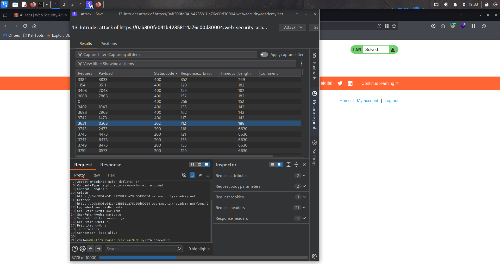

# Lab : 2FA bypass using a brute - force attack

https://portswigger.net/web-security/authentication/multi-factor/lab-2fa-bypass-using-a-brute-force-attack

- الفكره من الLab ده انك معاك الVictim's credentials بس مش عارف تخش بسبب ال 2FA code فا هنعمل عليه brute - force بس لو كتبت غلط او دخلت الcode فا الsession هتتغير و هتروح علي log in تاني فا هتعمل brute - force بس عاوزين marco and Session Handling Rule علشان بعد كل request لل 2FA يعيد تسجيل الدخول علشان نحصل علي valid CSRF token

```bash
1. 
```





















اللاب ده من فئة **Multi-Factor Authentication vulnerabilities**، والمشكلة هنا **بسيطة جدًا في جوهرها**: كود الـ 2FA **4 أرقام بس** (يعني من `0000` لـ `9999`، يعني 10,000 احتمال بس)، **ومفيش أي حماية حقيقية من brute-force** على العدد ده — يعني تقدر تجرب كل الاحتمالات لحد ما توصل للكود الصح.

المشكلة الوحيدة العملية هنا: **لو غلطت مرتين متتاليتين، السيرفر بيعمل لك logout بالكامل**، فمينفعش تكمل تجربة الأكواد في نفس الجلسة — لازم تسجل دخول تاني (username + password) قبل كل محاولة أو كل شوية محاولات.

### التحدي التقني

بما إنك هتتعمل logout بعد كل محاولة أو اتنين، تحتاج طريقة تخلي Burp Intruder **يسجل دخول تلقائيًا من جديد قبل كل محاولة** بدل ما تعمل ده يدويًا آلاف المرات. هنا بييجي دور **Burp Macros + Session Handling Rules**.

### خطوات الحل بالتفصيل

#### 1. افهم الـ Flow والمشكلة

سجل دخول بـ `carlos:montoya`، ولما توصل لصفحة إدخال كود الـ 2FA، جرب تدخل كود غلط مرتين ولاحظ إنك بترجع لصفحة اللوجن من الأول (يعني الـ session بتتلغي).

#### 2. اعمل Macro تسجل الدخول تلقائيًا

1. روح لـ **Settings (⚙️) → Sessions → Macros → Add**.
2. هتفتحلك نافذة **Macro Recorder** فيها كل الريكوستات، اختار بالترتيب:

```
   GET /login
   POST /login
   GET /login2
```

(يعني: افتح صفحة اللوجن → ابعت بيانات carlos → افتح صفحة إدخال كود الـ 2FA)

3. دوس **OK**، وهتفتح **Macro Editor**.

4. دوس **"Test macro"** وتأكد إن آخر response فيها صفحة طلب الكود المكوّن من 4 أرقام — ده تأكيد إن الماكرو شغالة صح.

5. دوس **OK** لحفظها.

#### 3. اعمل Session Handling Rule تستخدم الماكرو دي

1. روح لـ **Settings → Sessions → Session Handling Rules → Add**.
2. في تبويب **Scope**: تحت **URL Scope**، اختار **"Include all URLs"** (عشان الماكرو تتفعل على كل الريكوستات، بما فيها ريكوستات Intruder).
3. ارجع لتبويب **Details**، وتحت **Rule Actions**:
    - دوس **Add → Run a macro**.
    - اختار الماكرو اللي عملتها.
    - **مهم**: خلي الخيار على **"Run macro before each request"** (يعني قبل كل محاولة في Intruder، ينفذ الماكرو كامل: login + login2 من جديد، فتاخد session جديدة تلقائيًا قبل ما تجرب الكود).
4. دوس **OK** لحفظ الـ Rule.

بكده، كل محاولة في الـ Intruder هيسبقها تلقائيًا: تسجيل دخول كامل من جديد بـ `carlos:montoya`، فمش هتتأثر بمشكلة الـ logout.

#### 4. جهّز الريكوست في Intruder

1. اعترض `POST /login2` (ريكوست إدخال كود الـ 2FA)، وابعته على **Burp Intruder**.
2. حط **payload position** على قيمة `mfa-code` بس.

#### 5. جهّز الـ Payload (كل الأكواد الممكنة من 4 أرقام)

في **Payloads panel**:

- اختار نوع **"Numbers"**.
- Range: من `0` لـ `9999`.
- Step: `1`.
- Min/Max integer digits: `4` (عشان الأرقام تطلع بصيغة 4 خانات زي `0007` مش `7`).
- Max fraction digits: `0`.

ده هيولد كل الاحتمالات من `0000` لـ `9999`.

#### 6. اضبط Resource Pool

افتح **Resource pool panel**، وأنشئ pool جديد بـ:

```
Maximum concurrent requests = 1
```

مهم جدًا عشان الماكرو والـ session handling يشتغلوا **بالترتيب الصحيح** لكل محاولة، من غير تضارب لو الريكوستات راحت بالتوازي.

#### 7. شغّل الهجوم

دوس **Start attack**. الهجوم هيكون بطيء نسبيًا (لأن كل محاولة بتتطلب 3 ريكوستات إضافية للماكرو قبلها)، بس هيكمل يجرب كل الأكواد.

#### 8. لاحظ الملاحظة المهمة في وصف اللاب

> **الكود بيتجدد (reset) بشكل دوري وانت شغال الهجوم**. يعني لو الهجوم مكملش قبل ما الكود يتغير، ممكن يكون الكود الجديد رقم **إنت جربته بالفعل** قبل كده في نفس الهجوم. فممكن تحتاج **تكرر الهجوم كذا مرة** لحد ما تصادف اللحظة اللي فيها الكود الحالي يطابق رقم لسه ماجربتوش.
> 

#### 9. دوّر على الـ Response الناجح

راقب النتائج، ودوّر على أي response بحالة **`302`** (بدل `200` اللي بترجع مع الأكواد الغلط). لما تلاقيه:

- كليك يمين عليه → **"Show response in browser"**.
- انسخ اللينك اللي بيديك Burp وافتحه في المتصفح.

#### 10. افتح My Account

هتلاقي نفسك مسجل دخول فعليًا بحساب `carlos`. دوس **"My account"** واللاب هيتحل تلقائيًا ✅.

### ليه ده بيحصل تقنيًا

المشاكل مجتمعة:

python

```python
def generate_2fa_code():    return random.randint(0, 9999)   # ❌ 4 أرقام بس = 10,000 احتمال، مساحة صغيرة جدًا@app.route("/login2", methods=["POST"])def verify_2fa():    code = request.form.get("mfa-code")    attempts = get_failed_attempts(session)    if attempts >= 2:        logout_user()   # ❌ بيرجعك تسجل دخول من الأول بعد محاولتين غلط بس        return redirect("/login")    if check_2fa_code(session.user, code):        login_user(session.user)        return redirect("/my-account"), 302    increment_failed_attempts(session)    return "Invalid code", 200
```

المشكلة الأساسية: **مساحة الكود صغيرة جدًا (4 أرقام بس، 10,000 احتمال)**، وده رقم **قابل للتغطية بالكامل بسهولة** حتى مع وجود قيد "محاولتين بس قبل الـ logout"، طالما إن عملية "تسجيل الدخول من جديد" ممكن تتأتمت بالكامل (زي ما عملنا بالماكرو).

### الدرس المستفاد

- **كود الـ 2FA لازم يكون طويل بما يكفي** (زي 6 أرقام على الأقل = مليون احتمال) عشان يخلي الـ brute-force غير عملي في الوقت المعقول، حتى لو الحماية من ناحية عدد المحاولات ضعيفة.
- **قيود "عدد المحاولات قبل logout" مش كافية لوحدها كحماية**، لو عملية "تسجيل الدخول من جديد" ممكن تتكرر أوتوماتيكيًا وبسهولة (زي هنا بالماكرو). الحماية الحقيقية لازم تكون **rate-limiting فعلي على مستوى الحساب** (زي: بعد X محاولة فاشلة على الـ 2FA، الحساب يتقفل فترة أطول بكتير، أو الكود يتجدد فورًا ويتطلب إعادة إرسال عبر قناة تانية).
- **Burp Macros + Session Handling Rules** أداة أساسية جدًا لأتمتة أي سيناريو معقد بيحتاج "إعادة تأسيس حالة (state)" قبل كل محاولة في هجوم Intruder — مش بس في 2FA، لكن في أي مكان فيه CSRF tokens متجددة أو sessions بتنتهي بسرعة.
- **Resource Pool بـ Concurrent requests = 1** ضروري لما يكون فيه تسلسل حالة (state sequence) حساس للترتيب، زي هنا حيث كل محاولة لازم تعتمد على نتيجة الماكرو اللي قبلها بالظبط.
- الملاحظة عن "الكود بيتجدد أثناء الهجوم" بتوضح مبدأ مهم: بعض آليات الحماية (زي تجديد الكود دوريًا) بتقلل من فعالية الهجوم لكن مبتمنعوش تمامًا، وده بيخلي الهجوم يحتاج **صبر وتكرار** مش استحالة كاملة.
