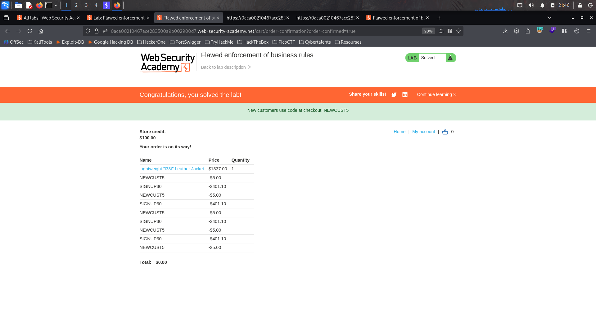

# Lab : Flawed enforcement of business rules

https://portswigger.net/web-security/logic-flaws/examples/lab-logic-flaws-flawed-enforcement-of-business-rules

- الفكره من الLab ده ان الcoupon فيه مشكله ايه هي ان لو دخلت coupon وجيت تدخله تاني مش هيقبل بس لو معاك اتنين coupon وفصلت مبنهم يعني مره الcoupon1 وبعدين الcoupon2 هيقبل الاتنين اكنر من مره لحاد اما تخلي الموقع مدين ليك بفلوس 🤣😂

```bash
1. 
```


