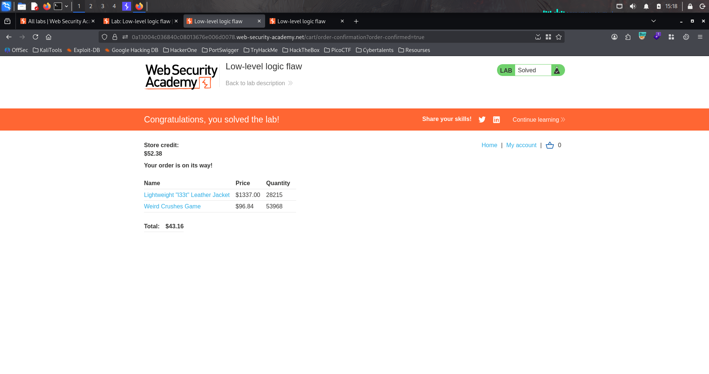

# Lab : Low - Level logic flaw

https://portswigger.net/web-security/logic-flaws/examples/lab-logic-flaws-low-level

- الفكره من الLab ده ان parameter الquantity مبيفبلش السالب ولا اي نوع من الbug التاني بس لو بعت من منتج معين كتير اوي لحاد اما اوصل لحد معين السعر بيقلب بالسلب

```bash
1. 
```


