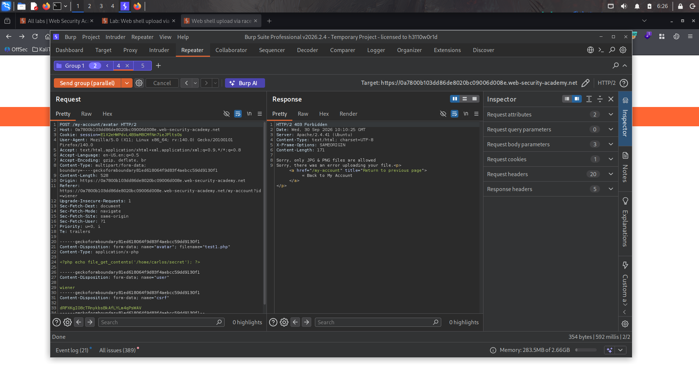
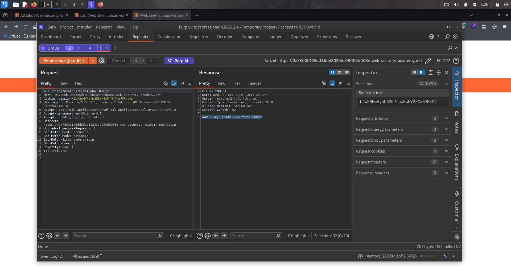

# Lab : Web shell upload via race condition

https://portswigger.net/web-security/file-upload/lab-file-upload-web-shell-upload-via-race-condition

- الفكره من الLab ده ان الfunction الي بيتحمل الصور مصابه ب race condition يعني هو بيتحقق الاول بعجين بيبص علي الامتداد فا لو بعت اسرع من البرنامج و هو لسه في الاول وهو بيتحقق من المحتوي هعرف اشوف الexploitation

```bash
1. <?php
$target_dir = "avatars/";
$target_file = $target_dir . $_FILES["avatar"]["name"];

// temporary move
move_uploaded_file($_FILES["avatar"]["tmp_name"], $target_file);

if (checkViruses($target_file) && checkFileType($target_file)) {
    echo "The file ". htmlspecialchars( $target_file). " has been uploaded.";
} else {
    unlink($target_file);
    echo "Sorry, there was an error uploading your file.";
    http_response_code(403);
}

function checkViruses($fileName) {
    // checking for viruses
    ...
}

function checkFileType($fileName) {
    $imageFileType = strtolower(pathinfo($fileName,PATHINFO_EXTENSION));
    if($imageFileType != "jpg" && $imageFileType != "png") {
        echo "Sorry, only JPG & PNG files are allowed\n";
        return false;
    } else {
        return true;
    }
}
?> ===> الكود المصاب 

2. 
```





اللاب ده من فئة **Race Conditions**، وتحديدًا استغلال **فجوة زمنية (time window)** بين لحظتين في معالجة السيرفر للملف المرفوع.

### المشكلة في الكود (من الـ Hint)

php

```php
$target_file = $target_dir . $_FILES["avatar"]["name"];// 1) الملف بيتحرك للفولدر النهائي فورًاmove_uploaded_file($_FILES["avatar"]["tmp_name"], $target_file);// 2) بعد كده بس بيتم التحقق منهif (checkViruses($target_file) && checkFileType($target_file)) {    echo "uploaded successfully";} else {    unlink($target_file);   // لو فشل الفحص، يتم حذفه    ...}
```

**المشكلة الجوهرية**: الملف **بيتخزن في مكان "متاح للتنفيذ" قبل ما يتم التحقق منه**. فيه **فجوة زمنية صغيرة** بين لحظة رفع الملف ولحظة حذفه (لو فشل الفحص) — وخلال الفجوة دي، **الملف موجود فعليًا وقابل للتنفيذ**. لو قدرت تبعت طلب لتنفيذ الملف **بالظبط في اللحظة دي**، هتاخد النتيجة قبل ما يتشال.
