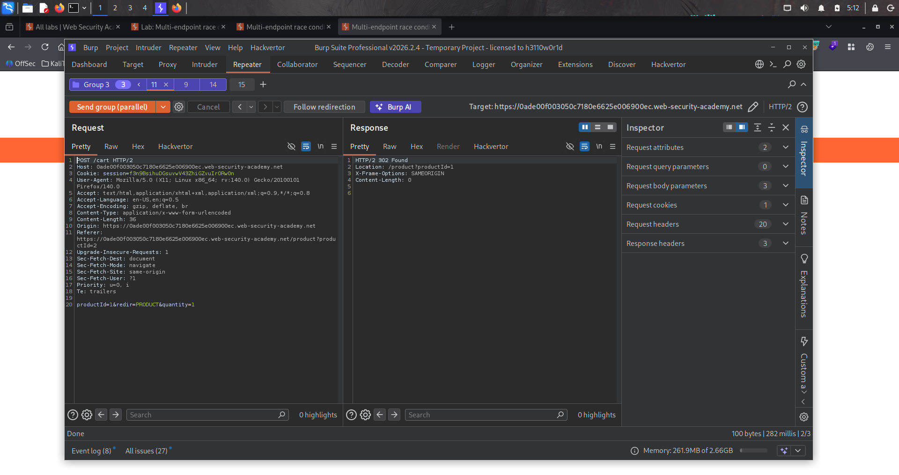
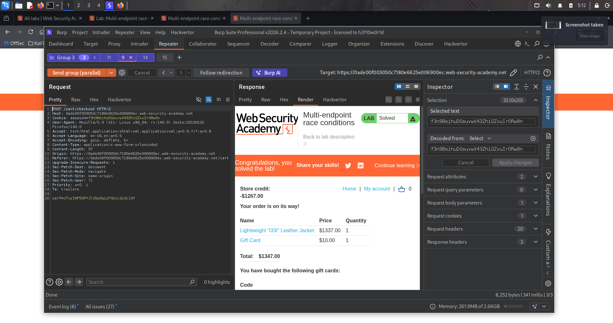
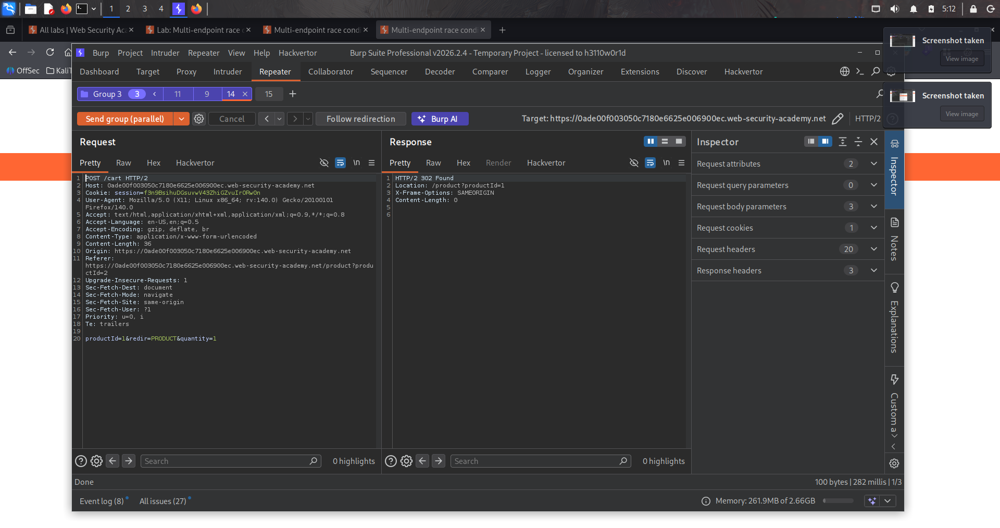

# Lab : Multi - endpoint race conditions

https://portswigger.net/web-security/race-conditions/lab-race-conditions-multi-endpoint

- الفكره من الLab ده

```bash
1. 
```







### الفكرة العامة (نوع الثغرة)

اللاب ده كمان من فئة **Race Conditions**، لكن هنا الثغرة **مش في نفس الـ endpoint** زي اللاب السابق (login rate limiting)، لكن **عبر endpoint-ين مختلفين** بيشتغلوا مع بعض على **نفس الحالة المشتركة (shared state)** — وهي **محتويات عربة التسوق (cart) ورصيدك**. ده بيُعرف بـ **"Multi-endpoint race condition"**.

### طبيعة الثغرة

عملية الشراء بتمر بمرحلتين منفصلتين (endpoints مختلفين):

1. **`POST /cart`**: بيضيف منتج للعربة.
2. **`POST /cart/checkout`**: بيتحقق من إن رصيدك كافي، وبينفذ عملية الشراء.

المشكلة الجوهرية: **فيه فجوة زمنية بين لحظة "التحقق من الرصيد الكافي" ولحظة "تأكيد وخصم المبلغ فعليًا"** أثناء عملية الـ checkout. لو قدرت **تضيف منتج تاني للعربة بالظبط في اللحظة دي** (بعد ما التحقق حصل، وقبل ما العملية تخلص وتتأكد)، ممكن **تشتري أكتر مما رصيدك يسمح بيه**.

### خطوات الحل بالتفصيل

#### المرحلة 1: توقع نقطة التصادم المحتملة (Predict a potential collision)

1. سجل دخول واشتري **gift card** عادي، عشان تفهم الـ purchasing flow الطبيعي.
2. افحص endpoints التعامل مع العربة في **Proxy history**: `POST /cart` (إضافة) و`POST /cart/checkout` (تنفيذ الطلب).
3. اختبر `GET /cart` **مع وبدون session cookie**. هتلاحظ إنك من غير الكوكي بتشوف عربة فاضية — ده معناه إن **حالة العربة مخزّنة على السيرفر (server-side) ومرتبطة بالـ session/user ID بتاعك**.
4. الاستنتاج: بما إن الحالة **مشتركة ومرتبطة بمفتاح واحد (الـ session)**، فيه احتمال **تصادم (collision)** لو فيه أكتر من عملية بتحاول تقرأ/تعدّل نفس الحالة في نفس الوقت.
5. لاحظ إن إرسال الطلب واستلام تأكيد الطلب الناجح **بيحصلوا في دورة request/response واحدة** — يعني العملية كلها (تحقق + تنفيذ) بتحصل "داخل" نفس الطلب، لكن قد يكون فيها **خطوات داخلية متتالية** (مش atomic بالكامل).
6. الفرضية: ممكن يكون فيه **race window بين "التحقق من كفاية الرصيد" و"تأكيد الطلب"** — يعني لو ضفت منتج تاني للعربة **في اللحظة دي بالظبط**، العملية ممكن "تتجاهل" المنتج الإضافي من حسابات التحقق، لكن **تضيفه فعليًا للطلب النهائي**.

#### المرحلة 2: قياس السلوك (Benchmark)

1. ابعت `POST /cart` و`POST /cart/checkout` على **Burp Repeater**، وضيفهم لـ **Group واحدة**.
2. ابعت الطلبين **بالتتابع على اتصال واحد (single connection)** كذا مرة، ولاحظ إن **أول طلب دايمًا بياخد وقت أطول بكتير من التاني**.
3. ضيف طلب `GET` للصفحة الرئيسية **في أول المجموعة** (قبل الطلبين)، وابعت الثلاثة بالتتابع. لاحظ إن **الطلب الأول لسه بياخد وقت أطول**، لكن **"تسخين" الاتصال (warming the connection) بالطلب الإضافي ده** خلى الطلبين التانيين (cart و checkout) **يتنفذوا في فجوة زمنية أصغر بكتير بينهم**.
4. الاستنتاج: التأخير ده **سببه بنية الشبكة الخلفية (network architecture)**، مش وقت معالجة كل endpoint لوحده — يعني **مش جزء من الثغرة نفسها**، ومش هيعطّل الهجوم.
5. شيل طلب الـ `GET` من المجموعة.
6. تأكد إن عندك **gift card واحد بس** في العربة.
7. عدّل `POST /cart` في المجموعة بحيث `productId` يبقى **`1`** (الجاكيت الهدف، "Lightweight L33t Leather Jacket").
8. ابعت الطلبات بالتتابع تاني.
9. لاحظ إن الطلب **مرفوض بسبب "insufficient funds"** — ده السلوك المتوقع والطبيعي (بدون استغلال).

#### المرحلة 3: إثبات المفهوم (Prove the concept)

1. شيل الجاكيت من العربة، وضيف **gift card تاني**.
2. في Repeater، ابعت نفس الطلبين **بالتوازي (in parallel)** بدل التتابع.
3. افحص رد `POST /cart/checkout`:
    - لو رجع نفس رد "insufficient funds"، شيل الجاكيت من العربة وكرر الهجوم (ممكن يحتاج عدة محاولات بسبب طبيعة التوقيت العشوائية في الـ race condition).
    - لو رجع **`200`**، تحقق هل اشتريت الجاكيت فعليًا — لو آه، اللاب اتحل ✅.

### ليه ده بيحصل تقنيًا

python

```python
@app.route("/cart/checkout", methods=["POST"])def checkout():    cart = get_cart(session)    total_price = sum(item.price for item in cart.items)    if session.user.balance < total_price:   # ❌ نقطة التحقق (Check)        return "Insufficient funds", 400    # ⏳ فجوة زمنية هنا — لو بعتّ POST /cart في اللحظة دي، العربة بتتغير!    deduct_balance(session.user, total_price)   # ❌ نقطة التنفيذ (Use) — بتحسب على أساس عربة قد تكون اتغيرت    create_order(cart)    return "Order placed successfully", 200
```

المشكلة الجوهرية هنا هي نمط كلاسيكي في عالم الـ race conditions اسمه **TOCTOU (Time-Of-Check to Time-Of-Use)**:

- **وقت التحقق (Check)**: السيرفر بيحسب إجمالي السعر بناءً على **محتويات العربة في اللحظة دي**، ويتأكد إن رصيدك كافي.
- **وقت الاستخدام (Use)**: السيرفر بينفذ عملية الخصم والشراء الفعلي، لكن بناءً على **عربة ممكن تكون اتغيرت** بين اللحظتين، لو طلب `POST /cart` تاني وصل في نفس الفترة دي وضاف منتج جديد **بعد** ما التحقق خلص لكن **قبل** ما التنفيذ يتم.

بإرسال طلب `POST /cart` (إضافة الجاكيت) **بالتوازي بالظبط** مع طلب `POST /cart/checkout`، بتخلق سيناريو: **الـ checkout بيتحقق من رصيدك على أساس عربة فيها gift card بس** (سعر قليل، رصيدك كافي)، لكن **وقت التنفيذ الفعلي، العربة بقى فيها كمان الجاكيت** (اللي اتضاف من الطلب التاني المتزامن)، فالطلب النهائي **بيشمل الجاكيت كمان من غير ما يتحقق من كفاية الرصيد له**.

### الدرس المستفاد

- **TOCTOU (Time-Of-Check to Time-Of-Use) فئة كلاسيكية من الـ race conditions**، مش بس في مصادقة المستخدمين (زي اللاب السابق)، لكن في **أي عملية بتتحقق من شرط معين ثم تنفذ فعل بناءً عليه** — خصوصًا لما الحالة (state) بتكون **مشتركة بين أكتر من endpoint**.
- **"تسخين الاتصال" (connection warming)** تقنية مهمة جدًا في اختبار race conditions — بتساعدك تفرّق بين **التأخير الطبيعي للشبكة/البنية التحتية** و**التأخير الفعلي الناتج عن معالجة السيرفر للطلب نفسه**، وده بيحسّن دقة توقيت هجومك.
- **العمليات اللي بتضم أكتر من خطوة (تحقق ثم تنفيذ) لازم تكون Atomic بالكامل** — يعني لازم تُنفذ كـ **transaction واحدة غير قابلة للمقاطعة** على مستوى قاعدة البيانات (زي `SELECT ... FOR UPDATE` في SQL، أو آليات locking مناسبة)، بحيث مفيش طلب تاني يقدر "يتداخل" في المنتصف.
- **Burp Repeater Groups (sequence + parallel sending)** كافية تمامًا لاكتشاف واستغلال race conditions من النوع ده، لأن الهجوم محتاج بس **طلبين مختلفين** يتزامنوا، مش عشرات الطلبات المتطابقة زي اللاب السابق (اللي احتجنا فيه Turbo Intruder للدقة العالية).
- **"Multi-endpoint race conditions" أصعب في الاكتشاف من "single-endpoint race conditions"** لأن الباحث محتاج يفهم **العلاقة المنطقية بين endpoints مختلفة ظاهريًا** (إضافة للعربة، وتنفيذ الطلب) ويدرك إنهم بيشتغلوا على **حالة مشتركة واحدة** ممكن يحصل فيها تضارب.
