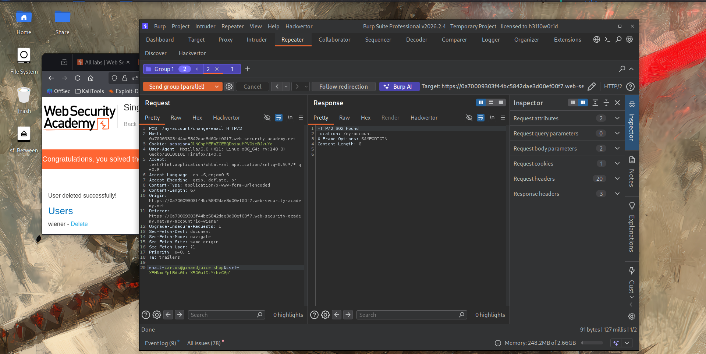
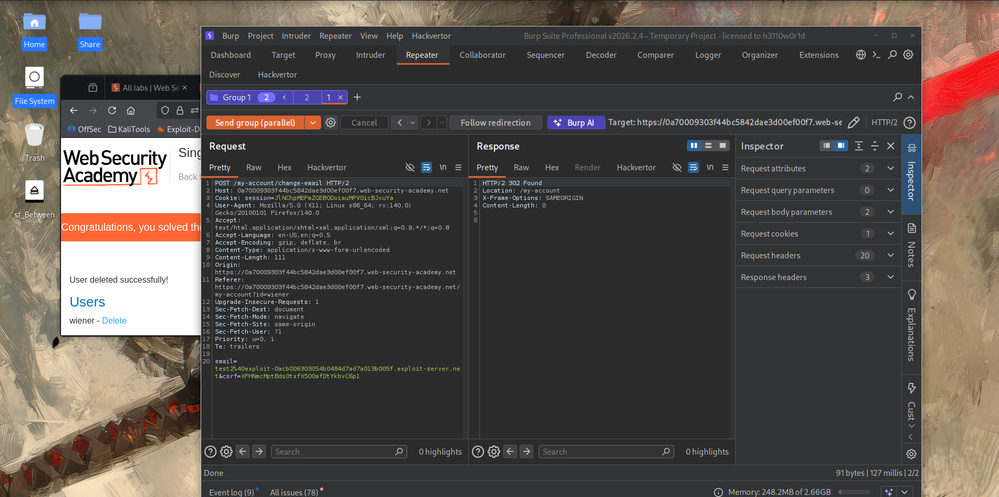

# Lab : Single - endpoint race conditions

https://portswigger.net/web-security/race-conditions/lab-race-conditions-single-endpoint

- الفكره من الLab ده

```bash
1. 
```





اللاب ده من فئة **Race Conditions**، لكن هنا الثغرة في **endpoint واحد بس** (عكس اللاب اللي فات اللي كانت بين اثنين). الـ endpoint هو **تغيير الإيميل** (`POST /my-account/change-email`)، والمشكلة في **كيفية تخزين وإرسال إيميل التأكيد** عند وجود أكتر من طلب تغيير إيميل بيحصلوا في نفس الوقت تقريبًا.

### الهدف النهائي من اللاب

فيه إيميل `carlos@ginandjuice.shop` عنده **دعوة معلّقة (pending invite)** ليكون admin، لكنه **لسه معملش حساب**. أي حساب ينجح "يدّعي" (claim) الإيميل ده (يعني يأكده كإيميل بتاعه) **هيرث صلاحيات admin تلقائيًا**. المطلوب: استغلال race condition عشان تقدر **تأكد الإيميل ده لحسابك انت** (`wiener`)، رغم إن المفروض متقدرش تطلب إيميل تأكيد لعنوان "مش بتاعك" عادي.

### طبيعة الثغرة بالتفصيل

#### الـ Flow العادي لتغيير الإيميل

1. تطلب تغيير الإيميل لعنوان جديد.
2. السيرفر **يخزّن الإيميل الجديد ده كـ "pending" في قاعدة البيانات** (مرتبط بحسابك).
3. السيرفر **يبعت إيميل تأكيد** لهذا العنوان، فيه **لينك بتوكن فريد**.
4. لو دخلت على اللينك، الإيميل "الـ pending" بيتأكد ويبقى إيميلك الرسمي.

#### نقطة الضعف

السيرفر بيخزّن **إيميل pending واحد بس في كل مرة** (مش list)، يعني لو بعتّ طلب تغيير إيميل جديد، **القيمة القديمة بتتبدّل بالجديدة** في قاعدة البيانات (overwrite، مش append).

المشكلة الأعمق: **عملية إرسال إيميل التأكيد بتتكون من خطوتين منفصلتين زمنيًا**:

1. **السيرفر بيبدأ مهمة (task) لإرسال الإيميل** (يعني بيقرر "هبعت إيميل تأكيد دلوقتي").
2. **السيرفر بيروح يجيب الإيميل الـ pending من قاعدة البيانات** عشان يحطه في محتوى الإيميل (template rendering) ويبعته فعليًا.

فيه **فجوة زمنية (race window)** بين الخطوتين دول. لو طلب تاني (بإيميل مختلف) غيّر قيمة الـ "pending email" في قاعدة البيانات **بالظبط في الفجوة دي**، النتيجة هتكون: **الإيميل هيتبعت لعنوان X، لكن محتوى الإيميل (فيه الـ token) هيكون مرتبط بعنوان Y** (اللي كان "pending" وقت ما السيرفر قرا من قاعدة البيانات، مش وقت ما بدأ المهمة).

### إزاي اكتشفنا الثغرة (خطوة بخطوة، بالترتيب المنطقي)

#### المرحلة 1: توقع التصادم المحتمل (Predict a potential collision)

**الهدف هنا: فهم السلوك الطبيعي، ومحاولة استنتاج نقطة ضعف منطقية محتملة قبل أي استغلال فعلي.**

1. جرب غيّر إيميلك لعنوان تحت تحكمك (`anything@exploit-ID.exploit-server.net`). هتلاقي إيميل تأكيد بيوصلك فيه لينك بتوكن.
2. كمّل العملية (دوس اللينك) وتأكد إن الإيميل اتغيّر فعلاً في حسابك.
3. جرب طلب **إيميلين مختلفين ورا بعض بسرعة** (مش بالتوازي، بس واحد ورا التاني). روح للإيميل كلاينت.
4. **الملاحظة المهمة**: لو جربت تستخدم **لينك التأكيد الأول** (بتاع أول إيميل طلبته)، هتلاقيه **بقى غير صالح**. ده معناه إن السيرفر **بيخزن pending email واحد بس في كل لحظة**، وأي طلب جديد **بيستبدل (overwrite) القديم**، مش بيضيفه. وده بالظبط **نقطة التصادم المحتملة** اللي إحنا دورنا عليها — بما إن فيه "قيمة واحدة مشتركة" بتتغير، فيه احتمال تضارب لو أكتر من طلب حاول يغيّرها في نفس اللحظة.

#### المرحلة 2: قياس السلوك الطبيعي (Benchmark)

**الهدف هنا: نشوف إزاي النظام بيتصرف في الحالة العادية (بدون تزامن)، عشان بعدين نقارن ونلاحظ الفرق لما نعمل تزامن فعلي.**

1. ابعت طلب `POST /my-account/change-email` على **Repeater**.
2. حط التاب في **Group**، وكرره (**Duplicate**) لحد ما يبقى عندك **20 تاب**.
3. في كل تاب، غيّر أول جزء من الإيميل بحيث يكون **فريد لكل طلب** (`test1@...`, `test2@...`, إلخ لحد `test20@...`).
4. ابعت المجموعة **بالتتابع (in sequence)** على اتصالات منفصلة.
5. روح للإيميل كلاينت، ولاحظ: **كل طلب جابله إيميل تأكيد واحد مطابق تمامًا لعنوانه** — يعني في الحالة الطبيعية (التتابعية)، النظام بيشتغل صح 100%، مفيش أي تضارب.

#### المرحلة 3: البحث عن دليل (Probe for clues)

**الهدف هنا: نكرر نفس الطلبات، لكن المرة دي بالتوازي، عشان نشوف هل التزامن بيكشف تضارب فعلي.**

1. ابعت نفس المجموعة العشرين تاني، لكن المرة دي **بالتوازي (in parallel)** — يعني كل الطلبات العشرين بتوصل للسيرفر في نفس اللحظة تقريبًا.
2. روح للإيميل كلاينت، وادرس الإيميلات الجديدة. **الملاحظة الحاسمة**: المرة دي، **عنوان المستلم في الإيميل (اللي ظهر في محتوى الإيميل) مش دايمًا مطابق للعنوان اللي اتبعتله فعلاً**! يعني إيميل اتبعت لـ `test5@...`، لكن محتواه بيتكلم عن (أو فيه توكن خاص بـ) `test12@...` مثلاً.
3. **الاستنتاج**: فيه **فجوة زمنية (race window)** بين:
    - لحظة ما السيرفر "يقرر" إنه هيبعت إيميل لعنوان معين (بناءً على الـ pending value وقتها).
    - لحظة ما السيرفر فعليًا **بيقرا من قاعدة البيانات** عشان يجيب القيمة المستخدمة في بناء محتوى الإيميل (الـ template).
4. لو طلب تاني **غيّر الـ pending email في قاعدة البيانات بالظبط في الفجوة دي**، النتيجة: **إيميل بيتبعت لعنوان، لكن التوكن اللي جواه خاص بعنوان مختلف تمامًا** (اللي كان "آخر قيمة" وقت القراءة الفعلية من الداتابيز).

#### المرحلة 4: إثبات المفهوم (Prove the concept) — الاستغلال الفعلي

**الهدف هنا: نستغل الفجوة دي بدقة لصالح الهدف المطلوب (نسرق توكن تأكيد خاص بـ [carlos@ginandjuice.shop](mailto:carlos@ginandjuice.shop) لصالح إيميلنا احنا).**

1. اعمل **Group جديدة فيها نسختين بس** من `POST /my-account/change-email`:
    - **الطلب الأول**: الإيميل = `anything@exploit-ID.exploit-server.net` (إيميلك انت، اللي هتستلم عليه الإيميل).
    - **الطلب الثاني**: الإيميل = `carlos@ginandjuice.shop` (الهدف، إيميل المدعو للأدمن).
2. ابعت الطلبين **بالتوازي**.
3. افحص الإيميل اللي وصلك:
    - **لو جالك إيميل ومحتواه بيتكلم عن إيميلك انت نفسه** → يبقى التوقيت ماظبطش، كرر المحاولة.
    - **لو جالك إيميل تأكيد (على عنوانك انت) لكن محتواه/التوكن بتاعه فعليًا بيخص `carlos@ginandjuice.shop`** → ✅ نجحنا! دوس على اللينك ده.

**ليه ده بيحصل بالظبط؟** السيناريو المثالي: الطلب التاني (`carlos@...`) كتب قيمته في الداتابيز كـ **pending**. الطلب الأول (إيميلك) بدأ "مهمة إرسال إيميل"، لكن **لسه ماقراش من الداتابيز**. في اللحظة دي بالظبط، قراءة الداتابيز (المرتبطة بطلبك انت) **لقت قيمة `carlos@...`** (لأنها آخر حاجة اتكتبت)، فالسيرفر **بعت الإيميل التأكيدي لعنوانك انت، لكن بتوكن خاص بـ `carlos@ginandjuice.shop`**!

1. بما إن اللينك ده فيه توكن **صالح لتأكيد `carlos@ginandjuice.shop`**، لما تدوس عليه، حسابك (`wiener`) **هياخد الإيميل ده رسميًا**.
2. روح لصفحة حسابك، هتلاقي **لينك جديد للوصول للأدمن بانل** (لأن حسابك دلوقتي مرتبط بإيميل عنده صلاحيات admin معلّقة).
3. افتح الأدمن بانل واحذف `carlos`. اللاب هيتحل تلقائيًا ✅.

### ليه ده بيحصل تقنيًا

python

```python
@app.route("/my-account/change-email", methods=["POST"])def change_email():    new_email = request.form.get("email")    update_pending_email(session.user, new_email)   # ❌ بيكتب في الداتابيز فورًا (overwrite)    send_confirmation_email_task(session.user)   # ⏳ مهمة منفصلة، بتاخد وقت صغير قبل ما تنفذ فعليًاdef send_confirmation_email_task(user):    # ده بيحصل بعد تأخير بسيط (queue, async task, إلخ)    pending_email = get_pending_email(user)   # ❌ بيقرا القيمة "الحالية" وقت التنفيذ، مش وقت الطلب الأصلي!    token = generate_token(pending_email)    send_email(to=pending_email, body=f"Confirm:{token}")
```

المشكلة الجوهرية: **الربط بين "مين طلب التغيير" و"لمين هيتبعت الإيميل ومحتواه" مش محكم زمنيًا** — السيرفر بيعتمد على **قراءة لاحقة من قاعدة بيانات مشتركة**، بدل ما **يحمل القيمة الصحيحة مباشرة من لحظة الطلب الأصلي نفسه** طول الوقت.

### الدرس المستفاد

- **تخزين "قيمة معلّقة واحدة فقط" (single pending value) بدل قائمة أو سجل منفصل لكل طلب** هو تصميم هش بطبيعته، لأنه بيخلق **نقطة اختناق مشتركة (shared mutable state)** عرضة للتصادم بين طلبات متزامنة.
- **أي عملية فيها "ابدأ مهمة" ثم "اقرأ بيانات لاحقًا لتنفيذها" لازم تحمل البيانات المطلوبة معاها من البداية**، مش تعتمد على قراءة لاحقة من مصدر مشترك ممكن يتغير في الأثناء (ده مبدأ TOCTOU بالظبط، زي اللاب السابق، لكن هنا بين "جدولة المهمة" و"تنفيذها" بدل "تحقق" و"تنفيذ").
- **منهجية اكتشاف الثغرة هنا كانت تدريجية ومنظمة**: (1) لاحظ سلوك غريب (استبدال pending value) → (2) جرب نفس الفعل بشكل متتابع للتأكد من السلوك الطبيعي → (3) جرب بالتوازي ولاحظ الفرق → (4) صمّم استغلال دقيق يستفيد من الفرق ده لتحقيق هدف محدد.
- هجوم ده يوضح إن **race conditions مش بس عن "كسر rate limits" أو "تجاوز حدود مالية"** (زي اللابين اللي فاتوا)، لكن ممكن تستخدم كمان لـ **"خلط" بيانات بين مستخدمين مختلفين** بطريقة تؤدي لاستيلاء على صلاحيات.
